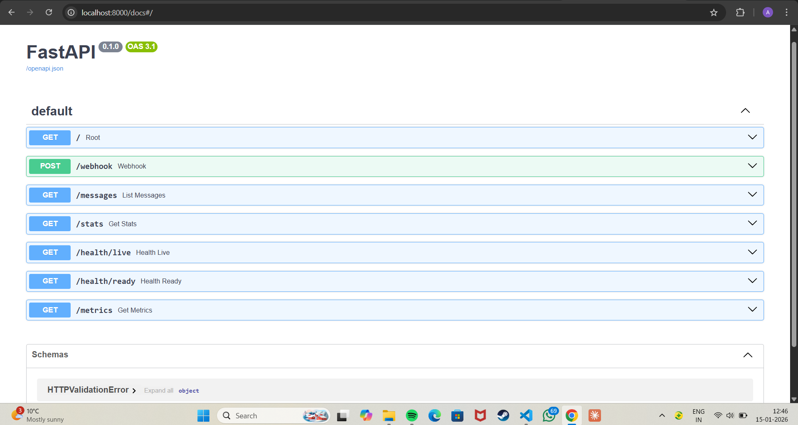

# Lyftr AI – Backend Assignment

Production-style FastAPI backend for securely ingesting webhook messages, storing them idempotently, and exposing analytics, health checks, and Prometheus metrics.

---

## Tech Stack

- Python 3.11
- FastAPI
- SQLite
- Docker & Docker Compose

---

## Project Structure

```
app/
├── main.py        # API routes & middleware
├── config.py      # Environment configuration
├── db.py          # Database logic
├── models.py      # Request validation
└── metrics.py     # Prometheus-style metrics

data/
└── app.db         # SQLite database (Docker volume)

Dockerfile
docker-compose.yml
requirements.txt
```

---

## Prerequisites

- Git
- Docker Desktop

---

## Run the Project (Recommended)

```bash
git clone https://github.com/ayushsingh0104/lyftr-ai-backend.git
cd lyftr-ai-backend
docker compose up --build
```

Service will be available at:

- API: http://localhost:8000
- Swagger UI: http://localhost:8000/docs

Stop the service:

```bash
docker compose down
```

---

## Local Development (Optional)

If you want to run or extend the service without Docker:

```bash
python -m venv venv
venv\Scripts\activate        # Windows
pip install -r requirements.txt
```

Set required environment variable:

```bash
set WEBHOOK_SECRET=testsecret    # Windows PowerShell
```

Run the server:

```bash
uvicorn app.main:app --reload
```

---

## API Documentation (Swagger UI)

Once the service is running, interactive API documentation is available at:

http://localhost:8000/docs

This interface allows testing all endpoints including `/webhook`, `/messages`, `/stats`, and `/metrics`.



---

## API Overview

### Health Checks
- `GET /health/live`
- `GET /health/ready`

### Webhook
- `POST /webhook`
- Secured using HMAC-SHA256
- Idempotent message ingestion
- - Webhook ingestion is **idempotent** using `message_id` to safely handle retries

### Messages
- `GET /messages`
- Supports pagination and filtering

### Stats
- `GET /stats`
- Aggregated message analytics

### Metrics
- `GET /metrics`
- Prometheus-compatible metrics

---

## Environment Variables

Configured via Docker Compose or local shell:

- `WEBHOOK_SECRET` – HMAC verification secret
- `DATABASE_URL` – SQLite database path

---

## Notes

- Fully Dockerized
- Secure webhook verification
- Idempotent data storage
- Designed for clarity and production readiness

---

## Production Notes

- Designed to be stateless and horizontally scalable
- SQLite is used for simplicity; can be replaced with PostgreSQL without API changes
